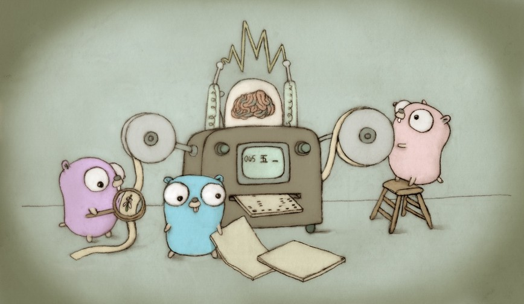
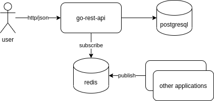

# Go REST API

Essa é uma API REST desenvolvida em Go.

Go é uma linguagem de paradigma imperativo, compilada, com foco em produtividade. Possui tipagem estática, ou seja, as propriedades precisam ter tipos específicos. Por ser uma linguagem compilada possui um desempenho em performance melhor do que outras linguagens como python, java, etc.

Essa é uma API simples para manter os registros de um catálogo de produtos. Possui dois endpoints para consulta e um para cadastro dos produtos. 

No cadastro a aplicação persite o produto em um banco de dados postgresql. A aplicação também utiliza o redis como broker para cadastro de produtos via eventos.



O redis é um banco de dados in-memory de alta performance. A partir da versão 5 foi disponibilizado a feature pub/sub que permite a utilização do banco como um broker de mensagens.

Documentação do redis: https://redis.io/topics/pubsub
Aprenda golang: https://tour.golang.org/welcome/1

## Stack

  Tecnologia           |  Versão       |
-----------------------|---------------|
  go                   | 1.14
  gorilla-mux          | v1.8.0
  lumberjack           | v2.0.0
  postgres-driver      | v1.8.0
  go-redis             | v8.1.3

## Dependências

* go1.14
* docker
* docker-compose
* make

## Instalação

* Subida da aplicação (docker): ``` make docker-build```

## Execução

* Para cadastrar um produto: ``` curl -i -X POST -H "Content-Type: application/json" http://localhost:8080/products -d '{"name":"Test","type":"ABC","description":"description...","price":120.00}' ```
* Para consultar um produto: ``` curl -i -H "Accept: application/json" http://localhost:8080/products/1 ```
* Para listar todos os produtos: ``` curl -i -H "Accept: application/json" http://localhost:8080/products ```
* Para registrar o produto via evento:
```shell
docker exec -it redis /bin/sh
redis-cli
publish productCreateChannel '{"name":"Test2","type":"XYZ","description":"produto evento","price":200.00}'
```
Após isso execute a api list e verifique se o seu produto foi cadastrado no catálogo.